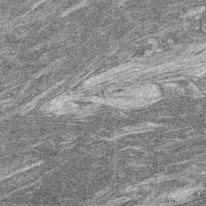
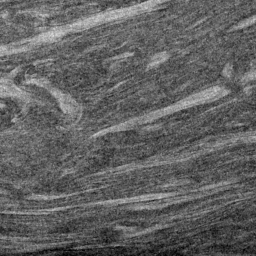
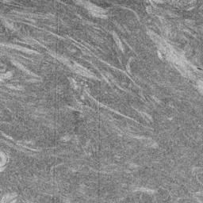
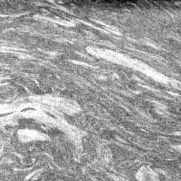

[](http://creativecommons.org/licenses/by/4.0/)
[](https://www.python.org)
[](https://jupyter.org)
[](https://pytorch.org)

# microDCGAN
## _Deep convolutional generative adversarial network for generation of computed tomography images of discontinuously carbon fiber reinforced polymer microstructures_
Steffen Klinder<sup>1
[](https://orcid.org/0009-0003-3916-1733)
</sup>and
Juliane Blarr<sup>1*
[](https://orcid.org/0000-0003-0419-0780)
</sup>

<sub>
<sup>1*</sup>Institute for Applied Materials – Materials Science and Engineering, Karlsruhe Institute of Technology (KIT), Kaiserstraße 12, Karlsruhe, 76131, Baden-Württemberg, Germany. <br>   
</sub>

</br>

*Corresponding author. E-mail: juliane.blarr@kit.edu; </br>
Contributing author: steffen.klinder@student.kit.edu; 

Correspondence and requests for materials should be addressed to Juliane Blarr.

> [!Note]
> This is the accompanying repository to the paper "_Deep convolutional generative adversarial network for generation of computed tomography images of discontinuously carbon fiber reinforced polymer microstructures_" by Blarr et al., published in Nature Scientific Reports in 2024. The work is based on the data set "_2D images of CT scans of carbon fiber reinforced polyamide 6_", made available in 2023, which can be accessed separately. See [Overview](#overview) for more information.

## Table of contents

1. [Overview](#overview)
2. [How to run the code](#how-to-run-the-code)
5. [Sources and inspiration](#sources-and-inspiration)
6. [Software and versions](#software-and-versions)
7. [Hardware](#hardware)
8. [License and citation](#license-and-citation)
9. [Acknowledgments](#acknowledgments)

## Overview

### Associated material
If you use the code in this repository _and_ the associated data set, please cite both DOIs (see [License and citation](#license-and-citation)).

#### Paper
More information on theory, methods and results can be found in the accompanying paper by Blarr et al. (Nature Scientific Reports 2024):
- [Deep convolutional generative adversarial network for generation of computed tomography images of heterogeneous low-contrast microstructures](doi.org/XX.XXXXX/XXXX) (DOI: XX.XXXXX/XXXX)

#### Data set
The data set used for this work was published separately:
- [2D images of CT scans of carbon fiber reinforced polyamide 6](https://doi.org/10.35097/1822) (DOI: 10.35097/1822)

---
<details>
   <summary><b>More information on the data set</b></summary>
   <br>

   The dataset includes a total of 29.280 2D images taken from 3D µCT scans of carbon fiber reinforced polyamide 6. Those images were used to train the neural network presented in this repository. <br>

   The data set can be downloaded as *.tar file from the source linked above and is licensed under a [Creative Commons Attribution 4.0 International License][cc-by]. 
   The actual image folder is located in the subdirectory _data/dataset/_ as a *.7z file.
   In the following, a number of exemplary images are depicted.
   
   <p align="center">
      
      
      
      
   </p>

   Those images are named as follows, e.g.:
   
   **C1_1_1024to256_IA_offset128_median5_bl128x_30.jpg**

with:
   - **C1**: Location on the initial plaque from which the specimen was extracted
   - **1**: Number of the plaque (either 1 or 2)
   - **1024to256**: An image section of resolution 1024 px × 1024 px was resized to 256 px × 256 px 
   - **IA**: The cv2 INTER_AREA interpolation operation was used for resizing
   - **offset128**: The cutout sections where taken with an offset of ±128 px from the center in x and y direction
   - **median5**: Images smoothing with a median kernel of size 5 px × 5 px was applied
   - **bl128**: Direction of cutout offset (e.g. bl ≙ bottom left) and offset in px (duplicate)
   - **x**: Type of image augmentation, in this case mirroring on the x-axis
   - **30**: Number of the initial layer the image is taken from (starting from 0)
</details>

---
## How to run the code
Simply execute the given Python or Jupyter notebook file. Note that the *.py file was run using SLURM job manager, you therefore might need to comment the lines waiting for command line input. Training parameters can be adjusted beforehand inside the file itself.
The JupyterLab environment was used to test and develope new models and to debug existing code segments. 

In the following an exemplary file structure for running the *.py files is depicted:
```
├── project_folder
│   ├── files
|      ├── microDCGAN.py
|      ├── job.sh
|      ├── log_*.log
|      └── ...
│   └── data
|      ├── input
|         └── 256x256
|               ├── real_1.jpg
|               ├── real_2.jpg
|               ├── real_3.jpg
|               └── ...
|      └── output
|         └── 256x256
|               ├── fake_1.jpg
|               ├── fake_2.jpg
|               ├── fake_3.jpg
|               └── ...
```

Take a look at the presented paper for an overview of the used training parameters.

## Sources and inspiration

- ### DCGAN Tutorial - Generative Adversarial Networks
  The DCGAN tutorial by Nathan Inkawhich is provided on the official [PyTorch website](https://pytorch.org/tutorials/beginner/dcgan_faces_tutorial.html) and served as a starting point for this project. The code can be accessed from [this](https://github.com/pytorch/tutorials/blob/main/beginner_source/dcgan_faces_tutorial.py) GitHub repository as well.
  
- ### lung DCGAN 128x128 
  This Jupyter Notebook by Milad Hasani can be viewed on [Kaggle](https://www.kaggle.com/code/miladlink/lung-dcgan-128x128) and contains a DCGAN for generation of X-ray images of the human chest. The project is based on a random sample of the NIH Chest X-ray Dataset with a resolution of 128 px × 128 px. However, the general structure of generator and discriminator network was found to work well for even larger resolutions. Note that the original code was released under the [Apache 2.0](https://www.apache.org/licenses/LICENSE-2.0) open source license. Used code sequences were adjusted accordingly and are clearly marked as such in the provided *.py respectively *.ipynb file.

## Software and versions
This project is entirely written in Python programming language using both native \*.py files and Jupyter notebooks (*.ipynb). 
The latter were used for initial tests with smaller image resolutions as well as for debugging. The *.ipynb file was then converted into native Python code.

#### Python
The following libraries are needed to run the *.py file in [Python](https://www.python.org/) 3.6.8:
- [PyTorch](https://pytorch.org/) 1.10.1
- [Torchvision](https://pytorch.org/vision/stable/index.html) 0.11.2
- [Numpy](https://numpy.org/) 1.19.5
- [OpenCV](https://opencv.org/) cv2 4.7.0.72
- [Matplotlib](https://matplotlib.org/) 3.3.4
- [TorchMetrics](https://lightning.ai/docs/torchmetrics/stable/) 0.8.2
- [Torchinfo](https://github.com/TylerYep/torchinfo) 1.5.4

#### Jupyter Notebook
The *.ipynb file was tested with [Python](https://www.python.org/) 3.9.7 and uses the following additional libraries as well:
- [tqdm](https://tqdm.github.io/) 4.64.1
- [IPython](https://ipython.org/) 7.16.3

Note that some code snippets from the Jupyter Notebook are incompatible with the older Python version!

## Hardware
In order to train the models, four NVIDIA Tesla V100 GPUs with 32 GB accelerator memory each as well as two Intel Xeon Gold 6230 processors with a total of 40 cores at a processor frequency of 2.1 GHz were used. The final configuration described in the corresponding paper required 25.36 GB of RAM. 
Please note that SSIM values were calculated subsequently because of their high computational cost. However, no GPU power was used for this step yet.

## License and citation
### License
This work is licensed under a [Creative Commons Attribution 4.0 International License][cc-by].

[![CC BY 4.0][cc-by-image]][cc-by]

[cc-by]: http://creativecommons.org/licenses/by/4.0/
[cc-by-image]: https://i.creativecommons.org/l/by/4.0/88x31.png

### Citation
#### Code
Please cite the associated paper if you used code from this repository or your work was inspired by it. </br>
BibTex:
```
@article{Blarr2024,
  title={Deep convolutional generative adversarial network for generation of computed tomography images of discontinuously carbon fiber reinforced polymer microstructures},
  author={Blarr, Juliane; Klinder, Steffen; Liebig, Wilfried V.; Inal, Kaan; Kärger, Luise; Weidenmann, Kay A.},
  journal={Nature Scientific Reports},
  year={2024},
  doi = {XX.XXXXX/XXXX}
}
```
#### Dataset
In case you also chose to use the associated data set in your work, please do cite it as well: </br>
BibTex:
```
@misc{Blarr2023,
   title = {{2D} images of {CT} scans of carbon fiber reinforced polyamide 6},
   author = {Blarr, Juliane and Klinder, Steffen},
   publisher = {Karlsruhe Institute of Technology},
   year = {2023},
   doi = {10.35097/1822}
}
```

<!---© 2024 The Authors--->

## Acknowledgments
<i><p align=justify> 
The research documented in the corresponding manuscript has been funded by the Deutsche Forschungsgemeinschaft (DFG, German Research Foundation), project number 255730231, within the International Research Training Group “Integrated engineering of continuous-discontinuous long fiber reinforced polymer structures“ (GRK 2078). The support by the German Research Foundation (DFG) is gratefully acknowledged. The authors would also like to thank the Fraunhofer ICT for its support in providing the plaques produced in the LFT-D process under the project management of Christoph Schelleis. Support from Covestro Deutschland AG, as well as Johns Manville Europe GmbH in the form of trial materials is gratefully acknowledged. This work was performed on the computational resource bwUniCluster funded by the Ministry of Science, Research and the Arts Baden-Württemberg and the Universities of the State of Baden-Württemberg, Germany, within the framework program bwHPC.
</p></i>
